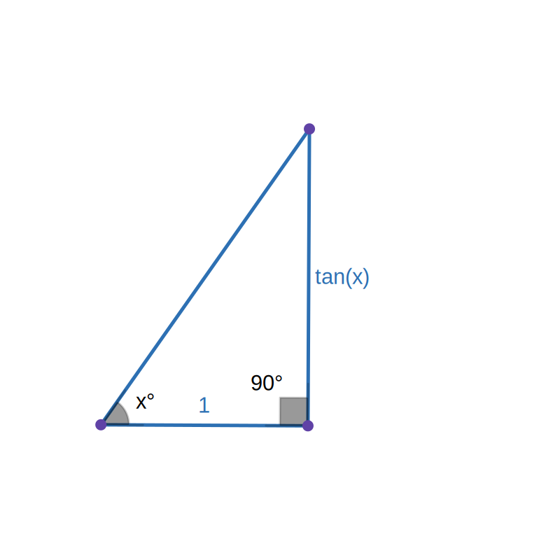
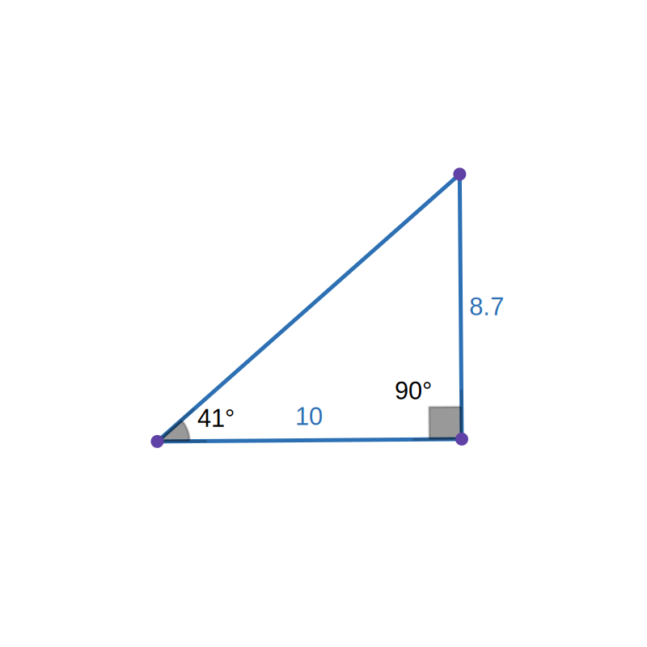
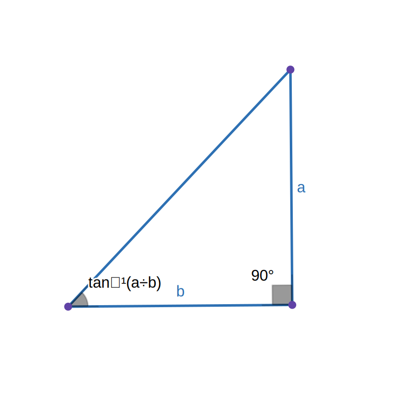
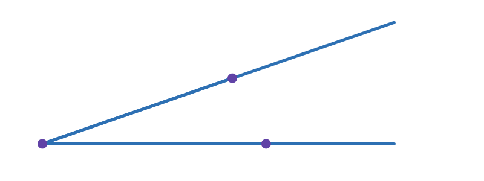
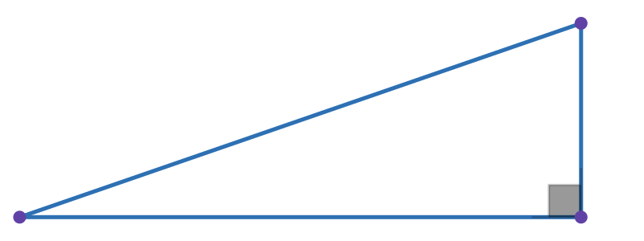
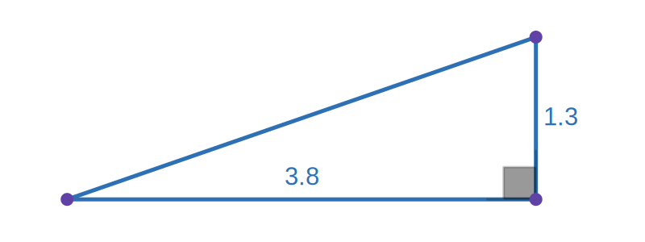

---
next:
  text: "Lucide Icon Name Stats"
  link: "../lucide-icon-name-stats"
---

# Angles Without Protractor

How to draw and measure angles without a protractor.

::: details Table of contents
[[toc]]
:::

## What You Need

 - Calculator
 - Pencil
 - Ruler (or set square)

## Drawing

To draw angle $x^\circ$:
1. Calculate $\tan(x)$.
2. Draw a line with length 1cm.
3. Draw a perpendicular line with length $\tan(x)$cm.
4. Complete the triangle.

::: tip
For higher accuracy, multiply the lengths by a common factor.\
Replace steps 2 and 3 with:

2. Draw a line with length $k$ cm.
3. Draw a perpendicular line with length $k\tan(x)$ cm
:::
### Example

We want to draw a 41° angle.

1. $\tan(41^\circ)\approx0.87$
2. Draw a line with length 10cm.
3. Draw a perpendicular line with length 8.7cm.
4. Complete the triangle.

## Measuring

To measure an angle: 

1. Extend both sides of the angle (for accuracy).
2. Draw a line perpendicular to one side to form a right-angled triangle. 
3. Using a ruler, measure the base and height of the triangle.
4. The angle is equal to $\tan^{-1}\left(\frac{\text{height}}{\text{base}}\right)$

### Example

We want to measure this angle:

1. Extend both lines.

2. Draw a line perpendicular to the base.

3. Measure the base and height of the triangle.

4. The angle is $\tan^{-1}\left(\frac{3.8}{1.3}\right)=19^\circ$